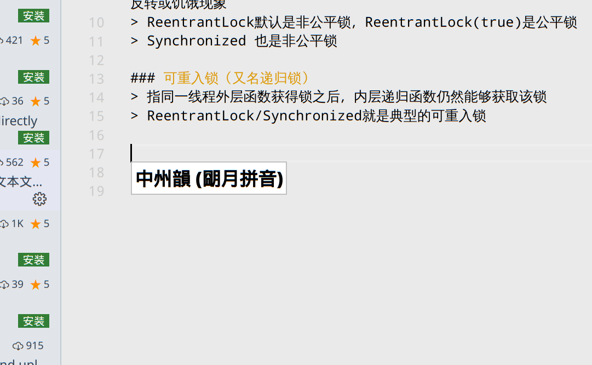

# java锁

##

### 公平锁
> 多个线程按照申请锁的顺序排队获取锁，先来后到，ording policy

### 非公平锁（允许加塞），非公平锁的优点在于吞吐量大
> 多个线程获取锁的顺序不是按照申请锁的顺序，有可能后申请的线程比先申请的线程优先获取锁，在高并发情况下，有可能造成优先级反转或饥饿现象
> ReentrantLock默认是非公平锁，ReentrantLock(true)是公平锁
> Synchronized 也是非公平锁

### 可重入锁（又名递归锁）
> 指同一线程外层函数获得锁之后，内层递归函数仍然能够获取该锁
> ReentrantLock/Synchronized就是典型的可重入锁

