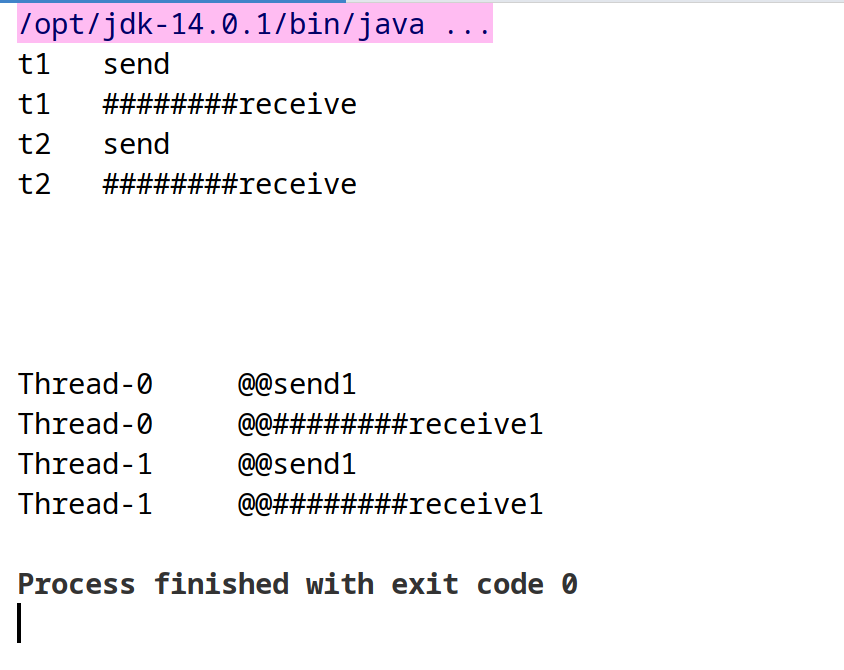

# java锁

## 都有哪些锁

- 公平锁（new ReentrantLock(true)）/非公平锁(new ReentrantLock(),new ReentrantLock(false),synchronized )
- 可重入（递归锁）(ReentrantLock,synchronized)
- 自旋锁（spinlock）

### 公平锁
> 多个线程按照申请锁的顺序排队获取锁，先来后到，ording policy

### 非公平锁（允许加塞），非公平锁的优点在于吞吐量大
> 多个线程获取锁的顺序不是按照申请锁的顺序，有可能后申请的线程比先申请的线程优先获取锁，在高并发情况下，有可能造成优先级反转或饥饿现象
> ReentrantLock默认是非公平锁，ReentrantLock(true)是公平锁
> Synchronized 也是非公平锁

```java
Lock lock = new ReentrantLock(); //非公平锁(unfair)
Lock lock1 = new ReentrantLock(true); //公平锁(fair)
```

### 可重入锁（又名递归锁）
> 指同一线程外层函数获得锁之后，内层递归函数仍然能够获取该锁
> ReentrantLock/Synchronized就是典型的可重入锁

- 可重入锁代码实现

```java
class Test implements Runnable {
    public synchronized void send() {
        System.out.println(Thread.currentThread().getName() + "\t send");
        receive();
    }

    public synchronized void receive() {
        System.out.println(Thread.currentThread().getName() + "\t ########receive");
    }

    Lock lock = new ReentrantLock(); //非公平锁(unfair)
    Lock lock1 = new ReentrantLock(true); //公平锁(fair)

    public void send1() {
        lock.lock();
        lock.lock(); //可以多次加锁但要对应多次解锁

        System.out.println(Thread.currentThread().getName() + "\t @@send1");
        receive1();
        lock.unlock();
        lock.unlock();
    }

    public void receive1() {
        lock.lock();
        System.out.println(Thread.currentThread().getName() + "\t @@########receive1");

        lock.unlock();
    }

    @Override
    public void run() {
        send1();
    }
}

public class ReentrantLockDemo {
    public static void main(String[] args) {
        Test test = new Test();

        new Thread(() -> {
            test.send();
        }, "t1").start();

        new Thread(() -> {
            test.send();
        }, "t2").start();

        try {
            TimeUnit.SECONDS.sleep(1);
        } catch (InterruptedException e) {
            e.printStackTrace();
        }

        System.out.println();
        System.out.println();
        System.out.println();
        System.out.println();

        Thread t3 = new Thread(test);
        Thread t4 = new Thread(test);

        t3.start();
        t4.start();
    }
}
```

- 输出效果




