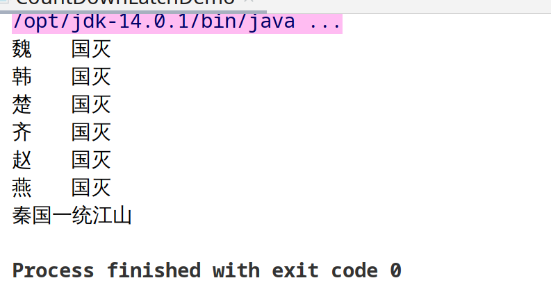
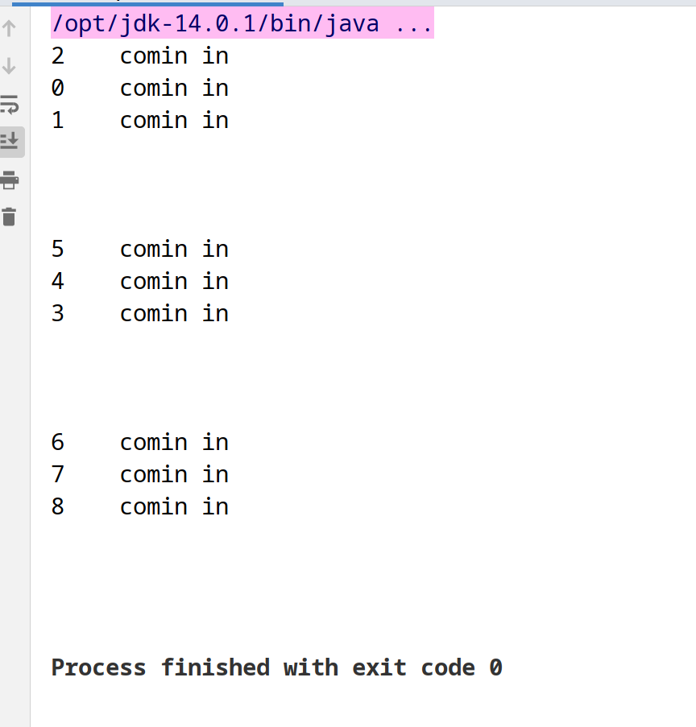

# java锁

## 都有哪些锁

- 公平锁（new ReentrantLock(true)）/非公平锁(new ReentrantLock(),new ReentrantLock(false),synchronized )
- 可重入（递归锁）(ReentrantLock,synchronized)
- 自旋锁（spinlock）

### 公平锁
> 多个线程按照申请锁的顺序排队获取锁，先来后到，ording policy

### 非公平锁（允许加塞），非公平锁的优点在于吞吐量大
> 多个线程获取锁的顺序不是按照申请锁的顺序，有可能后申请的线程比先申请的线程优先获取锁，在高并发情况下，有可能造成优先级反转或饥饿现象
> ReentrantLock默认是非公平锁，ReentrantLock(true)是公平锁
> Synchronized 也是非公平锁

```java
Lock lock = new ReentrantLock(); //非公平锁(unfair)
Lock lock1 = new ReentrantLock(true); //公平锁(fair)
```

### 可重入锁（又名递归锁）
> 指同一线程外层函数获得锁之后，内层递归函数仍然能够获取该锁
> ReentrantLock/Synchronized就是典型的可重入锁

- 可重入锁代码实现

```java
class Test implements Runnable {
    public synchronized void send() {
        System.out.println(Thread.currentThread().getName() + "\t send");
        receive();
    }

    public synchronized void receive() {
        System.out.println(Thread.currentThread().getName() + "\t ########receive");
    }

    Lock lock = new ReentrantLock(); //非公平锁(unfair)
    Lock lock1 = new ReentrantLock(true); //公平锁(fair)

    public void send1() {
        lock.lock();
        lock.lock(); //可以多次加锁但要对应多次解锁

        System.out.println(Thread.currentThread().getName() + "\t @@send1");
        receive1();
        lock.unlock();
        lock.unlock();
    }

    public void receive1() {
        lock.lock();
        System.out.println(Thread.currentThread().getName() + "\t @@########receive1");

        lock.unlock();
    }

    @Override
    public void run() {
        send1();
    }
}

public class ReentrantLockDemo {
    public static void main(String[] args) {
        Test test = new Test();

        new Thread(() -> {
            test.send();
        }, "t1").start();

        new Thread(() -> {
            test.send();
        }, "t2").start();

        try {
            TimeUnit.SECONDS.sleep(1);
        } catch (InterruptedException e) {
            e.printStackTrace();
        }

        System.out.println();
        System.out.println();
        System.out.println();
        System.out.println();

        Thread t3 = new Thread(test);
        Thread t4 = new Thread(test);

        t3.start();
        t4.start();
    }
}
```

- 输出效果


### 自旋锁spinlock

> 指尝试获取锁的线程不会立即阻塞，而是采用循环的方式不断的尝试获取锁，这样的好处是减少上下文切换的消耗，缺点是循环会消耗CPU

- 代码实现

```java
public class SpinLockDemo {

    private AtomicReference<Thread> atomicReference = new AtomicReference<>(); //初始化时没有值就为null

    public void myLock() {
        Thread thread = Thread.currentThread();
        System.out.println(thread.getName()+"\t come in...");
        while (!atomicReference.compareAndSet(null,thread)) {

            System.out.println(Thread.currentThread().getName()+"\t 锁被TA占用获取失败...");
            try {
                TimeUnit.SECONDS.sleep(1);
            } catch (InterruptedException e) {
                e.printStackTrace();
            }
        }
        System.out.println(thread.getName()+"\t 得到锁");
    }

    public void myUnLock() {
        Thread thread = Thread.currentThread();
        atomicReference.compareAndSet(thread,null);
        System.out.println(thread.getName()+"\t 释放锁");
    }


    public static void main(String[] args) {
        SpinLockDemo spinLockDemo = new SpinLockDemo();

        new Thread(() -> {
            spinLockDemo.myLock();
            try {
                TimeUnit.SECONDS.sleep(5);
            } catch (InterruptedException e) {
                e.printStackTrace();
            }
            spinLockDemo.myUnLock();
        },"TA").start();

        try {
            TimeUnit.SECONDS.sleep(2);
        } catch (InterruptedException e) {
            e.printStackTrace();
        }
        new Thread(() -> {
            spinLockDemo.myLock();
            spinLockDemo.myUnLock();
        },"TB").start();
    }
}
```

- 输出效果


### 独占锁（写锁）/共享锁（读锁）/互斥锁（读写） -- ReentrantReadWriteLock

> 优点：既保证一致性又保证并发性

- demo

```java
class MyCache{
    private volatile Map<String,Object> map = new HashMap<>();
    private ReentrantReadWriteLock lock = new ReentrantReadWriteLock();

    public void get(String key) {
        lock.readLock().lock();
        System.out.println(Thread.currentThread().getName()+"\t 开始读取： "+key);
        try {
            TimeUnit.MILLISECONDS.sleep(300);
        } catch (InterruptedException e) {
            e.printStackTrace();
        }
        Object obj = map.get(key);
        System.out.println(Thread.currentThread().getName()+"\t 读取完毕： "+key+"<==>" +obj);
        lock.readLock().unlock();
    }

    public void put(String key,Object val) {
        lock.writeLock().lock();
        System.out.println(Thread.currentThread().getName()+"\t 开始写入： "+key+"<==>" +val);
        try {
            TimeUnit.MILLISECONDS.sleep(300);
        } catch (InterruptedException e) {
            e.printStackTrace();
        }
        map.put(key, val);
        System.out.println(Thread.currentThread().getName()+"\t 开始写入： "+key+"<==>" +val);
        lock.writeLock().unlock();
    }
}

public class ReadWriteLockDemo {

    public static void main(String[] args) {
        MyCache myCache = new MyCache();

        for (int i = 0; i < 5; i++) {
            String s = ""+i;
            new Thread(() -> {
                myCache.put(s,s);
            },s).start();
        }

        for (int i = 0; i < 5; i++) {
            String s = ""+i;
            new Thread(() -> {
                myCache.get(s);
            },s).start();
        }
    }
}
```

- 输出结果


### CountDownLatch（到计数门闩）

> 个人理解： 人都走完才能锁门

- 样例代码

```java
public class CountDownLatchDemo {

    private static final int countrySize = 6;

    public static void main(String[] args) throws InterruptedException {
        CountDownLatch countDownLatch = new CountDownLatch(countrySize);
        for (int i = 1; i <= 6; i++) {
            new Thread(() -> {
                System.out.println(Thread.currentThread().getName()+"\t 国灭");
                countDownLatch.countDown();
            }, CountryEnum.forEachCountry(i).getMsg()).start();
        }

        countDownLatch.await();
        System.out.println("秦国一统江山");
    }
}
```

- 输出效果（会在6国灭完之后才会统一）
  


### CyclicBarrier（可循环屏障）

> 人到齐才能开会

- 代码
```java
public class CyclicBarrierDemo {

    public static void main(String[] args) {
        CyclicBarrier cyclicBarrier = new CyclicBarrier(7,new Thread(() ->{
            System.out.println("集齐七龙珠，召唤神龙");
        }));

        for (int i = 0; i < 7; i++) {
            final String temp = i+"";
            new Thread(() -> {
                System.out.println(Thread.currentThread().getName()+"\t发现龙珠"+"\t" +temp);
                try {
                    cyclicBarrier.await();
                } catch (InterruptedException e) {
                    e.printStackTrace();
                } catch (BrokenBarrierException e) {
                    e.printStackTrace();
                }
            },String.valueOf(i)).start();
        }
    }
}
```

- 输出结果（等到所有龙珠集齐才会召唤神龙）


### Semaphore

> 信号量主要用于两个目的，一个用于多个共享资源互斥使用（100个线程争夺10个资源），另一个用于并发线程数控制

```java
public class SemaphoreDemo {

    public static void main(String[] args) {
        Semaphore semaphore = new Semaphore(3);

        for (int i = 0; i < 9; i++) {
            new Thread(() -> {
                try {
                    semaphore.acquire();
                    System.out.println(Thread.currentThread().getName()+"\t comin in");
                    TimeUnit.SECONDS.sleep(3);
                    System.out.println();
                } catch (InterruptedException e) {
                    e.printStackTrace();
                }finally {
                    semaphore.release();
                }
            },String.valueOf(i)).start();
        }
    }
}
```

- 结果




