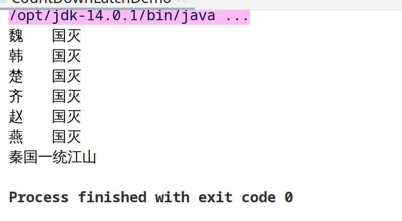
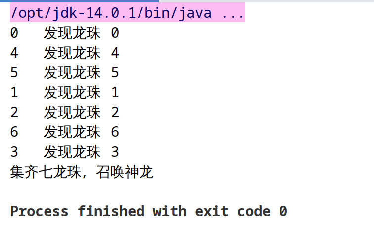
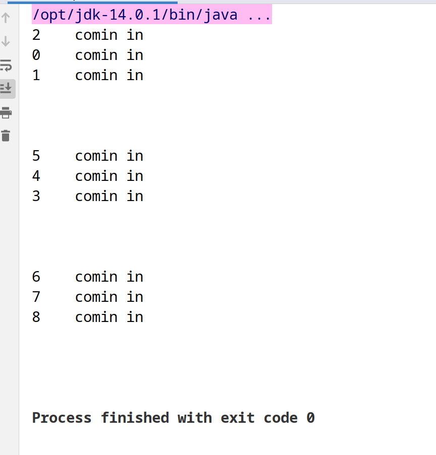
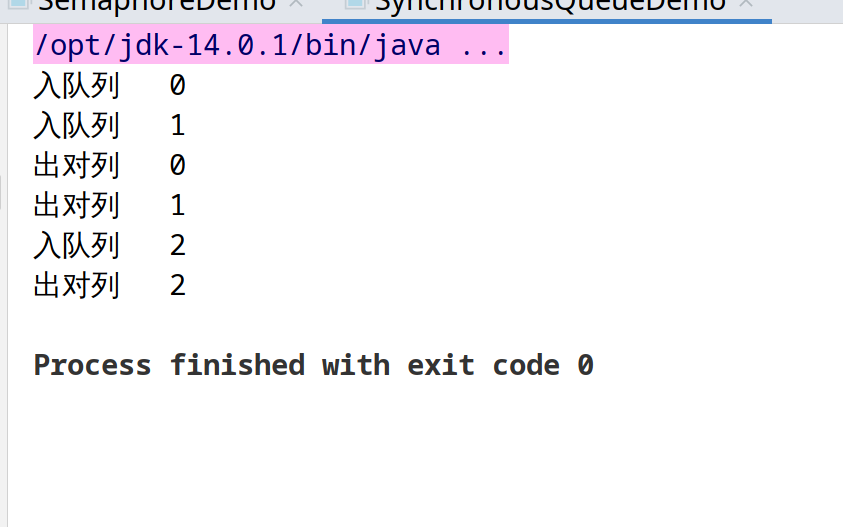
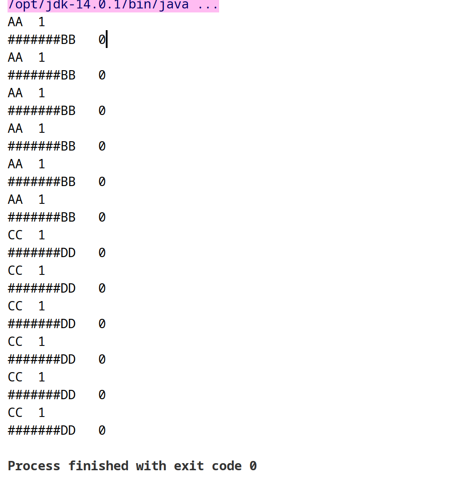

# JUC多线程及高并发

## volatile

> java虚拟机提供的轻量级同步机制，通过CPU的内存屏障实现可见性（在写操作后强制数据从缓存刷回主内存）和有序性（禁止对内存屏障前后的指令进行重排序优化）

### 特性
- 保证可见性
- 不保证原子性 (使用JUC下的atomic：cas)
- 禁止指令重排（有序性，按照代码顺序执行）

### JMM（java内存模型）程序访问变量的规范
> 每个线程创建JVM都会为其创建一个工作内存，而所有变量（对象属性，静态变量等）都存储在主内存，所以每当线程在访问变量时需要把变量从主内存拷贝一份在工作内存操作，完后再将变量回写到主内存

**JMM线程同步的规定**
  - 线程解锁前，必须把共享变量的值刷新回主内存
  - 线程加锁前，必须读取主内存的最新值到工作内存
  - 加锁解锁是同一把锁

**JMM特性**

1. 可见性（修改完变量后及时写回主内存，变量的变动对其它线程可见）
2. 原子性
3. 有序性：多线程环境下，由于编译器优化重排的存在，两个线程中使用的变量能否保证一致性是无法确定的，结果无法预测（处理器在指令重排时要考虑指令之间的依赖）

**用处**
1. 单例DCL模式：双端检锁机制（Double Check Lock），因为指令重排的原因双端检锁机制也有可能线程不安全需要对对象加volatile禁止指令重排
2. 缓存
3. cas中有大量的volatile 使用
4. ...

## CAS（CompareAndSwap,它是一条CPU并发原语）

> 比较并交换，判断内存中某个位置的值是否为预期，如果是更改为最新值，如果否就重新获取最新值比较并交换知道成功
> CAS的实现原理： 依赖与rt.misc.UnSafe.class (UnSafe依赖与CPU底层原语，原语的执行必须是连续的，在执行过程中不允许被中断，也就是说CAS是一条CPU的原子指令，不会造成所谓的数据不一致的问题，也就是说CAS是线程安全的。)

**缺点**

- 自旋锁，CPU消耗大
- 只能保证一个共享变量的原子操作，如果多个需要加锁
- ABA问题：线程1和线程2都从主内存中取出变量A，首先线程2修改为B并同步到主内存中然后又修改为A同步到主内存中，在线程2操作完后，线程1入场CAS发现主内存中A与缓存的A相同然后正常修改主内存中的值 <mark>尽管线程1操作成功，但不代表这个过程是没有问题的</mark>

**ABA问题解决（乐观锁）**

> 解决ABA问题的机制：加版本号（乐观锁）：JUC: **AtomicStampedReference**


### CountDownLatch（到计数门闩）

> 个人理解： 人都走完才能锁门

- 样例代码

```java
public class CountDownLatchDemo {

    private static final int countrySize = 6;

    public static void main(String[] args) throws InterruptedException {
        CountDownLatch countDownLatch = new CountDownLatch(countrySize);
        for (int i = 1; i <= 6; i++) {
            new Thread(() -> {
                System.out.println(Thread.currentThread().getName()+"\t 国灭");
                countDownLatch.countDown();
            }, CountryEnum.forEachCountry(i).getMsg()).start();
        }

        countDownLatch.await();
        System.out.println("秦国一统江山");
    }
}
```

- 输出效果（会在6国灭完之后才会统一）
  


### CyclicBarrier（可循环屏障）

> 人到齐才能开会

- 代码
```java
public class CyclicBarrierDemo {

    public static void main(String[] args) {
        CyclicBarrier cyclicBarrier = new CyclicBarrier(7,new Thread(() ->{
            System.out.println("集齐七龙珠，召唤神龙");
        }));

        for (int i = 0; i < 7; i++) {
            final String temp = i+"";
            new Thread(() -> {
                System.out.println(Thread.currentThread().getName()+"\t发现龙珠"+"\t" +temp);
                try {
                    cyclicBarrier.await();
                } catch (InterruptedException e) {
                    e.printStackTrace();
                } catch (BrokenBarrierException e) {
                    e.printStackTrace();
                }
            },String.valueOf(i)).start();
        }
    }
}
```

- 输出结果（等到所有龙珠集齐才会召唤神龙）



### Semaphore

> 信号量主要用于两个目的，一个用于多个共享资源互斥使用（100个线程争夺10个资源），另一个用于并发线程数控制

```java
public class SemaphoreDemo {

    public static void main(String[] args) {
        Semaphore semaphore = new Semaphore(3);

        for (int i = 0; i < 9; i++) {
            new Thread(() -> {
                try {
                    semaphore.acquire();
                    System.out.println(Thread.currentThread().getName()+"\t comin in");
                    TimeUnit.SECONDS.sleep(3);
                    System.out.println();
                } catch (InterruptedException e) {
                    e.printStackTrace();
                }finally {
                    semaphore.release();
                }
            },String.valueOf(i)).start();
        }
    }
}
```

- 结果




### BlockingQueue

#### 具体实现

- ArrayBlockingQueue： 由数组构成的有界阻塞队列
- LinkedBlockingQueue：由链表构成的有界（但是大小默认值为Integer.MAX_VALUE）阻塞队列
- PriorityBlockingQueue： 支持优先级排序的无界阻塞队列
- DelayQueue：使用优先级队列实现的延迟无界队列
- SynchronousQueue： 不存储元素的阻塞队列，即单个元素队列（每一个put都要等待一个take）
- LinkedTransferQueue：链表组成的无界阻塞队列
- LinkedBlockingDeque：由链表组成的双向阻塞队列
 

#### api

- 会抛异常
  - add(Obj); 添加元素，如果队列满了会报异常
  - remove();//删除队首FIFO，
  - remove(Obj); //删除指定  如果队列为空会抛异常
  - element();// 查看队首元素，主要用作验证，如果队列为空会抛异常
- 特殊值
  - offer(Obj); 添加元素队列满了返回false
  - peek()// 查看队首元素，如果队列为空会返回null
  - poll() // 出对列，会删除队首元素
- 阻塞（慎用）
  - put(Obj) // 如果队列满了就会阻塞线程等待队列有空间
  - take() // 如果队列空了就会阻塞线程等待队列有数
- 超时
  - offer(obj,timeout,TimeUnit); 超过时间停止阻塞
  - poll(timeout,TimeUnit); 超过时间停止阻塞

#### SynchronousQueue （同步队列）

> 单元素队列，每次put都会阻塞等待队列元素被消费

- code

```java
public class SynchronousQueueDemo {

    public static void main(String[] args) {
        BlockingQueue<String> blockingQueue = new SynchronousQueue<>();

        new Thread(() -> {
            try {
                for (int i = 0; i < 3; i++) {
                    System.out.println("入队列\t"+i);
                    blockingQueue.put(String.valueOf(i));
                }
            } catch (InterruptedException e) {
                e.printStackTrace();
            }
        },"putT").start();

        new Thread(() -> {
            try {
                for (int i = 0; i < 3; i++) {
                    TimeUnit.SECONDS.sleep(3);
                    System.out.println("出对列\t"+blockingQueue.take());
                }
            } catch (InterruptedException e) {
                e.printStackTrace();
            }
        },"takeT").start();
    }
}
```

- 输出效果



### 传统生产者消费者

- code

```java
class ShareData{
    private int num = 0;
    private Lock lock = new ReentrantLock();
    private Condition condition = lock.newCondition();

    public void increment() {
        lock.lock();
        try {
            // 判断
            while (num != 0) {
                condition.await();
            }
            //操作
            num++;
            System.out.println(Thread.currentThread().getName()+"\t"+num);
            //唤醒
            condition.signalAll();
        }catch (InterruptedException e) {
            e.printStackTrace();
        }finally {
            lock.unlock();
        }
    }

    public void decrement() {
        lock.lock();
        try {
            // 判断
            while (num == 0) {
                condition.await();
            }
            //操作
            num--;
            System.out.println(Thread.currentThread().getName()+"\t"+num);
            //唤醒
            condition.signalAll();
        }catch (InterruptedException e) {
            e.printStackTrace();
        }finally {
            lock.unlock();
        }
    }
}

public class ProdConsumer_TraditionDemo {
    public static void main(String[] args) {
        ShareData shareData = new ShareData();

        new Thread(() -> {
            for (int i = 0; i < 6; i++) {
                shareData.increment();
            }
        },"AA").start();


        new Thread(() -> {
            for (int i = 0; i < 6; i++) {
                shareData.increment();
            }
        },"CC").start();

        new Thread(() -> {
            for (int i = 0; i < 6; i++) {
                shareData.decrement();
            }
        },"#######BB").start();

        new Thread(() -> {
            for (int i = 0; i < 6; i++) {
                shareData.decrement();
            }
        },"#######DD").start();
    }
}
```

- 输出效果（生产者消费者交替）



