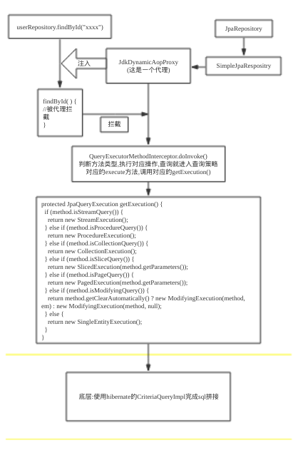

# SpringDataJPA

## JPA

>JPA是JAVA开发人员提供的一种对象/关系映射工具,JPA是一套规范

## Spring Data JPA

>Spring Data JPA是Spring基于ORM框架/JPA规范的基础上封装的一套JPA应用框架

### 配置
```
//maven
<dependency>
    <groupId>mysql</groupId>
    <artifactId>mysql-connector-java</artifactId>
</dependency>
            
<dependency>
    <groupId>org.springframework.boot</groupId>
    <artifactId>spring-boot-starter-data-jpa</artifactId>
</dependency>

//application.properties
spring.datasource.url=jdbc:mysql://*:*/test?useUnicode=true&characterEncoding=utf-8&serverTimezone=UTC&useSSL=true
spring.datasource.username=
spring.datasource.password=
spring.datasource.driver-class-name=com.mysql.jdbc.Driver
spring.jpa.properties.hibernate.hbm2ddl.auto=update
spring.jpa.properties.hibernate.dialect=org.hibernate.dialect.MySQL5InnoDBDialect
spring.jpa.show-sql=true

```
1. spring.jpa.properties.hibernate.hbm2ddl.auto有以下几种配置:
   
   - create:每次加载都会删除上一次生成的表(包括数据),然后重新生成新表,适用于每次执行测试前清空数据库的场景
   - creat-drop:每次加载都会生成表,但是SessionFactory关闭时所生成的表自动删除
   - update:最常用的属性,第一次加载时创建数据表(前提是已经指定数据库),以后加载时不会删除上一次生成的表,会根据实体更新只新增字段不会删除字段,即使实体中已经删除
   - validate:每次加载都会验证数据表结构,只会和已经存在的表进行比较,根据model修改表结构,但不会创建新表
   - 不配置此项表示禁用自动建表功能

2. Respository

- 建立entity
```
@Entity
@Data  //lombok 自动set/get
public class User {

    @Id
    @GeneratedValue
    private long id;
    @Column(nullable = false, unique = true)
    private String userName;
    @Column(nullable = false)
    private String password;
    @Column(nullable = false)
    private int age;
}
```
- 声明对应Repository接口,继承JpaRepository,默认支持CRUD操作
```
public interface UserRepository extends JpaRepository<User, Long> {

    User findByUserName(String userName);

}
```

- 测试
```
@Autowired
private UserRepository userRepository;

@Test
@Transactional //开启事务功能是为了单元测试的时候不造成垃圾数据
public void userTest() {
    User user = new User();
    user.setUserName("wyk");
    user.setAge(30);
    user.setPassword("aaabbb");
    userRepository.save(user);
    User item = userRepository.findByUserName("wyk");
    log.info(JsonUtils.toJson(item));
}
```
3. 实现原理

对测试进行debug,可以发现userRepository被注入了一个动态代理,被代理的类是JpaRepository的一个实现SimpleJpaRepositpry



4. 应用

- 基本查询
  >基本查询分为两种,一种是spring data 默认已经实现(只需继承JpaRepository),一种是根据查询的方法来自动解析层SQL

```
public interface UserRepository extends JpaRepository<User, Long> {
}

@Test
public void testBaseQuery() throws Exception {
    User user=new User();
    userRepository.findAll();
    userRepository.findOne(1l);
    userRepository.save(user);
    userRepository.delete(user);
    userRepository.count();
    userRepository.exists(1l);
    // ...
}
```

- 自定义简单查询
> 主要语法是:findxxxBy,readxxxBy,queryxxxBy,countxxBy,getxxxBy,{By}后面gen属性名称

```
User findByUserName(String userName);
User findByUserNameOrEmail(String username, String email);
Long deleteById(Long id);
Long countByUserName(String userName);
List<User> findByEmailLike(String email);
User findByUserNameIgnoreCase(String userName);
List<User> findByUserNameOrderByEmailDesc(String email);
```
具体命名方式如下:


Keyword	| Sample	| JPQL snippet
-|-|-
And|	findByLastnameAndFirstname|	… where x.lastname = ?1 and x.firstname = ?2
Or|	findByLastnameOrFirstname|	… where x.lastname = ?1 or x.firstname = ?2
Is,Equals|	findByFirstnameIs,findByFirstnameEquals|	… where x.firstname = ?1
Between|	findByStartDateBetween|	… where x.startDate between ?1 and ?2
LessThan|	findByAgeLessThan|	… where x.age < ?1
LessThanEqual|	findByAgeLessThanEqual|	… where x.age ⇐ ?1
GreaterThan|	findByAgeGreaterThan|	… where x.age > ?1
GreaterThanEqual|	findByAgeGreaterThanEqual|	… where x.age >= ?1
After|	findByStartDateAfter|	… where x.startDate > ?1
Before|	findByStartDateBefore|	… where x.startDate < ?1
IsNull|	findByAgeIsNull|	… where x.age is null
IsNotNull,NotNull|	findByAge(Is)NotNull|	… where x.age not null
Like|	findByFirstnameLike|	… where x.firstname like ?1
NotLike|	findByFirstnameNotLike|	… where x.firstname not like ?1
StartingWith|	findByFirstnameStartingWith|	… where x.firstname like ?1 (parameter bound with appended %)
EndingWith|	findByFirstnameEndingWith|	… where x.firstname like ?1 (parameter bound with prepended %)
Containing|	findByFirstnameContaining|	… where x.firstname like ?1 (parameter bound wrapped in %)
OrderBy|	findByAgeOrderByLastnameDesc|	… where x.age = ?1 order by x.lastname desc
Not|	findByLastnameNot|	… where x.lastname <> ?1
In|	findByAgeIn(Collection<age> ages)</age>|	… where x.age in ?1
NotIn|	findByAgeNotIn(Collection<age> age)</age>|	… where x.age not in ?1
TRUE|	findByActiveTrue()|	… where x.active = true
FALSE|	findByActiveFalse()|	… where x.active = false
IgnoreCase|	findByFirstnameIgnoreCase|	… where UPPER(x.firstame) = UPPER(?1)

- 复杂查询
  - 分页查询
  >在查询时需要传入参数Pageable,当有多个参数时Pageable建议作为最后一个参数传入,使用Pageable时需要传入页数,每页条目数和排序规则
```
Page<User> findALL(Pageable pageable);
Page<User> findByUserName(String userName,Pageable pageable);

@Test
public void testPageQuery() throws Exception {
    int page=1,size=10;
    Sort sort = new Sort(Direction.DESC, "id");
    Pageable pageable = new PageRequest(page, size, sort);
    userRepository.findALL(pageable);
    userRepository.findByUserName("testName", pageable);
}

// 其它查询形式
User findFirstByOrderByLastnameAsc();

User findTopByOrderByAgeDesc();

Page<User> queryFirst10ByLastname(String lastname, Pageable pageable);

List<User> findFirst10ByLastname(String lastname, Sort sort);

List<User> findTop10ByLastname(String lastname, Pageable pageable);

```

  - 自定义SQL查询
  >在 SQL 的查询方法上面使用 @Query 注解，如涉及到删除和修改在需要加上 @Modifying 。也可以根据需要添加 @Transactional 对事物的支持，查询超时的设置等
```
@Modifying
@Query("update User u set u.userName = ?1 where c.id = ?2")
int modifyByIdAndUserId(String  userName, Long id);

@Transactional
@Modifying
@Query("delete from User where id = ?1")
void deleteByUserId(Long id);

@Transactional(timeout = 10)
@Query("select u from User u where u.emailAddress = ?1")
User findByEmailAddress(String emailAddress);
```
  - 多表查询
  >多表查询在 spring data jpa 中有两种实现方式，第一种是利用 hibernate 的级联查询来实现，第二种是创建一个结果集的接口来接收连表查询后的结果，这里介绍第二种方式。
```
//创建结果集
public interface HotelSummary {

    City getCity();

    String getName();

    Double getAverageRating();

    default Integer getAverageRatingRounded() {
        return getAverageRating() == null ? null : (int) Math.round(getAverageRating());
    }

}

//定义方法
@Query("select h.city as city, h.name as name, avg(r.rating) as averageRating from Hotel h left outer join h.reviews r where h.city = ?1 group by h")
Page<HotelSummary> findByCity(City city, Pageable pageable);

@Query("select h.name as name, avg(r.rating) as averageRating from Hotel h left outer join h.reviews r group by h")
Page<HotelSummary> findByCity(Pageable pageable);

//返回类型设置为结果集
Page<HotelSummary> hotels = this.hotelRepository.findByCity(new PageRequest(0, 10, Direction.ASC, "name"));
```

