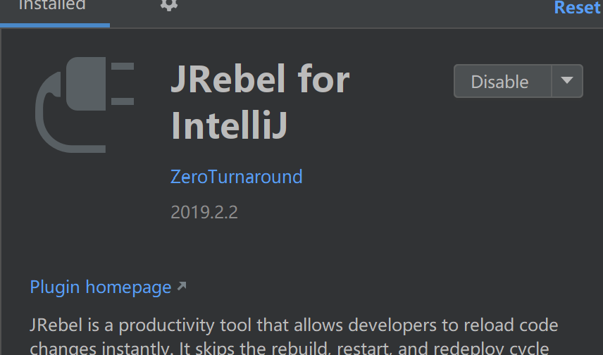
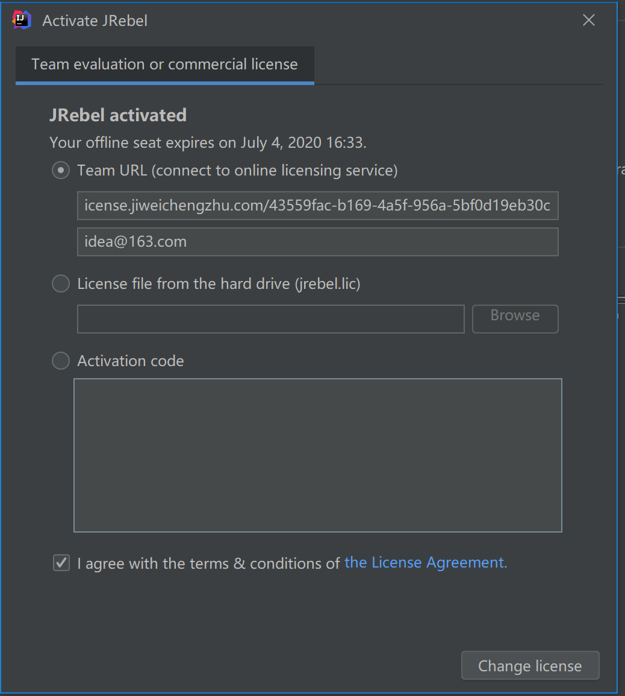

# IDEA 中 jrebel 本地debug实现热更新

## 安装以及激活jrebel

1. 安装jrebel插件
   
2. 激活,借用大佬搭建的激活服务，也可以查找他的激活[博客](https://example.com/scrambled-eggs.pdf):
   
   
激活地址为,需要在/后面加上uuid：
```
http://jrebel-license.jiweichengzhu.com/
```
## 开启idea的配置

1. 开启idea 自动构建
   ！[idea-auto-build](../../img/jrebel/idea-auto-build.png)

