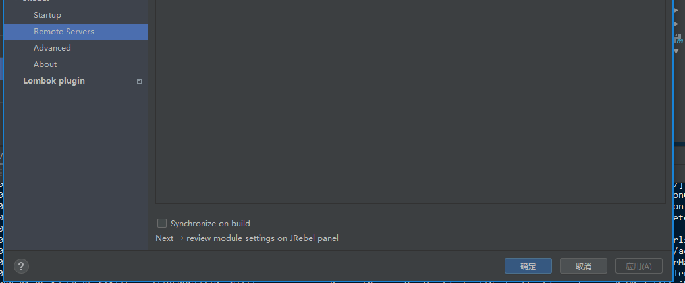

# jrebel 开启spring boot 2.X 的远程热部署

1. 下载jrebel agent 到远程服务器，并解压

```
curl -O http://dl.zeroturnaround.com/jrebel-stable-nosetup.zip
unzip jrebel-stable-nosetup.zip
```

2. 修改springBoot的启动启动信息：

将jrebel_home 替换为刚才解压的jrebel的路径即可

```
nohup java "-agentpath:[jrebel_home]/lib/libjrebel64.so" -Drebel.remoting_plugin=true -Xms1024m -Xmx1048m -XX:PermSize=256m -XX:MaxPermSize=512m -XX:MaxNewSize=512m -jar -Dspring.profiles.active=dev   ./my-app.jar &
```
3. 在idea中设置server url（你的应用的http地址：http://127.0.0.1:8080）

- 配置需要热更新的模块，并将项目入口模块勾选远程同步

- 远程同步按钮

- 另外如果你不需要每次构建就同步到远程可以把此选项取消勾选


