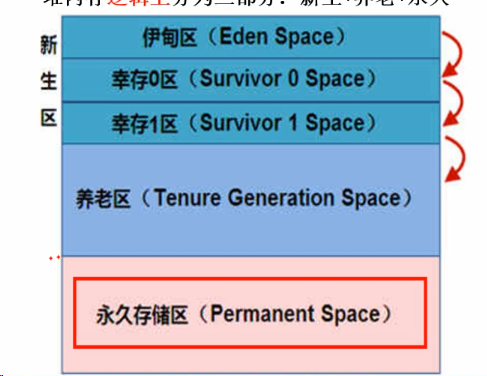
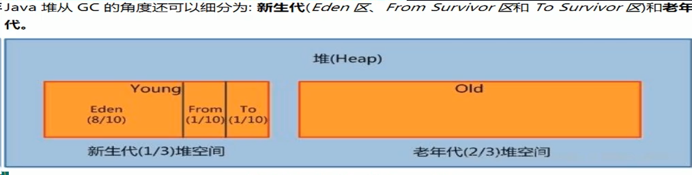

# 类的内存模型

### 本地方法栈（Native Method Stack）

1. native是一个java关键字表示原生指令（c++）
2.  执行引擎->本地方法接口 ->本地方法栈-> 本地方法库

### PC计数器（Progra Counter Register）

> 存储下一条将要执行的指令的内存地址，如果将要执行一个native方法没有对应的计数器

### 方法区（Method Area）

> 存储一个类的结构信息,是JVM规范，它的实际实现是永久代（元空间）

## 堆、栈（堆管存储，栈管运行）

### 堆
>逻辑上分为3部分：新生，老年，元空间（永久）；物理上分为2部分：新生代，老年代

> 元空间是方法区的实现，用来存储类信息+普通常量+静态常量+编译器编译后的代码
> 元空间与永久代的区别：永久代使用JVM堆内存，java8以后元空间使用主机物理内存

### 栈 （线程私有，不存在垃圾回收线程处理完自动清理 ）

- 存储8种基本类型+引用类型+方法
- StackOverFlowError（栈溢出）

