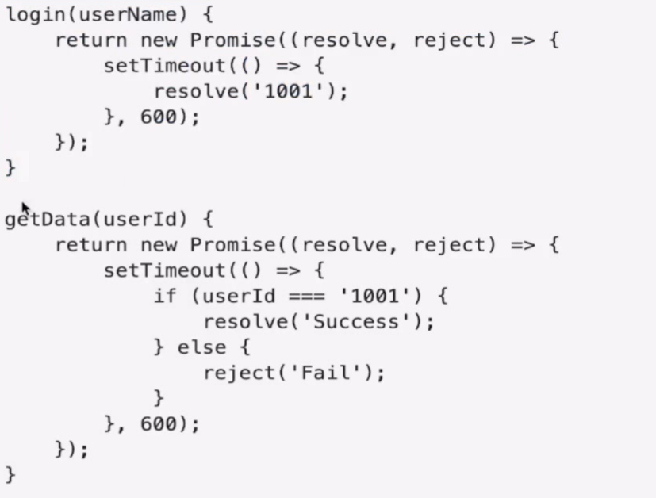
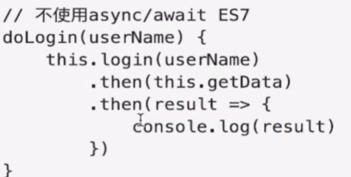

# ES基础
## ES各版本发展变化
ES版本|发布时间|新增特性
-|-|-
ES5|09-11|扩展了object\array\fouction的功能
ES6|15-6|类\模块化\箭头函数\函数参数默认值
ES7|16-3|incloudes\指数操作符
ES8|17-6|sync/await,object.values(),object.entries(),string padding

## ES6特性

1. 类(class)

```
class people {
    constructor(name,age){
        this.name=name;
        this.age=age;
    }
    //tostring 是原型对象的属性
    tostring() {
        console.log('name:' + this.name);
    }
}
var apeople = new people('xxx',18);
apeople.tostring();

//继承
class man extends people{
    constructor(sex){
        //子类必须super父类
        super('xxx',18);
        this.sex='male';
    }
}
```

2. 模块

ES6支持常量与变量的导出,ES6将一个文件视为一个模块

- 导出
    ```
    //a.js
    var name = 'xxx'
    const sqrt = Math.sqrt;
    //导出多个变量或者常量
    export {name,sqrt};
    ```
    导出函数
    ```
    //b.js
    export fuction add (num) {
        return num++;
    }
    ```
- 导入
    定义好的模块可以导入
    ```
    import {name,sqrt} from 'a';
    ```

3. 箭头函数

箭头函数不仅是function的缩写,箭头函数与包围它的代码共享同一个this,能很好的解决this的指向问题

- 箭头函数的结构
    箭头函数之前是一个控括号,单个参数名或者多个参数,箭头函数后面可以是一个表达式作为函数的返回值,或者是花括号括起来的函数体(return返回值或者返回undefined)
    ```
    //箭头函数的例子
    ()=>1
    v=>v+1
    (a,b)=>a+b
    ()=>{
        alert("xxx")
    }
    f=>{
        return 0
    }
    ```
    >无论是箭头函数还是bind,每次执行后都会返回一个新的函数的引用,因此如果需要函数的引用做别的事情(譬如卸载监听器),那么你必须保存这个函数的引用

4. 函数参数默认值
   
   ```
   fun (a=1,b=2){

   }
   ```

5. 模板字符串
   使用模板字符串使得字符串的拼接变得更加简单,只需要将变量放到大括号中
   ```
   //不使用模板字符串
   var name = 'name:' +name
   //使用模板字符串
   var name = 'name: ${name}'
   ```
6. 解构赋值
   
   快速的将数组或者字符串中提出值赋值给变量中
- 获取数组中的值
  - 从数组中获取值并赋值到变量中,变量的顺序与数组中对象的顺序对应
  - ```
    var foo = ["one","two","three"];
    var [one,two] = foo;
    //如果要忽略某个值可以如下使用
    var [first,,last] = foo;
    //也可以先声明变量
    var a,b ;
    [a,b] = foo
    //也可以设置默认值
    [a=0, , , , , , ,b=7]=foo; //a=one ,b=7
    //也可以很方便的交换两个变量的值
    var a=1
    var b=2
    [a,b] = [b,a]

    //获取对象的值
    const student = {
        name:'xxx',
        id:'1'
    }

    const {a ,b} = student  //a='xxx',b='1'
    ```

7. 延展操作符
   
   延展操作符(...)可以在函数调用和数组构造时,将数组表达式或string在语法层面展开,还可以在构造对象时以key-value的形式展开
   
   ```
   //函数调用
   fun(...aobject);
   //数组构造或字符串
   [...arrobj , 'a' , ..."string" , 5];
   //构造对象时进行克隆和属性拷贝
   let obj = {...fomobj}

8. 对象属性简写

在ES6中允许我们定义对象时不指定属性名
```
//不使用ES6
const name = "xxx",id ="1";
const stu = {   
    name:name,
    id:id
}
//使用ES6
const stu={
    name,
    id
}
```
9. Promise

promise是异步编程的一种解决方案,比传统的callback解决方案更加优雅
```
//不使用ES6
setTimeout(function(){
    console.log('hello');  //1秒后输出
    settimeout(function(){
        console.log("hi"); //2秒后输出
    },1000);
}, 1000)

//使用ES6
var wait =  new Promise(function(resolve,reject){
    settimeout(resolve,1000)
})

wait.then(function(){
    console.log("hello");
    return wait
}).then(function(){
    console.log("hi")
})
```
10. 支持了let和const,并且它们都是块级作用域只在{}内有效
```
{
    var a=1
    let b=2
}

console.log(a);  //输出1
console.log(b);  //输出undefined
```

## ES7特性

>includes() ; 指数操作符

1. Array.prototype.includes()

includes()函数用来判断数组是否包含某个值返回布尔
```
let arr =[1,2]
arr.includes('1')
```
2. 指数操作符
指数操作符(**)具有与Math.pow(..)等效的计算
```
Math.pow(2,10);  //1024
2**10; //1024
```

## ES8的特性
>async/await, Object.values(), Object.entries(), String padding, 函数列表结尾允许逗号, Object.getOwnPropertyDescriptors()

1. async/await(异步函数---promise)



```
async dologin(username){
    const uid = await this.login(username);
    const islogin = await this.getlogin(uid)
}
```
 - 几种使用场景
     - 