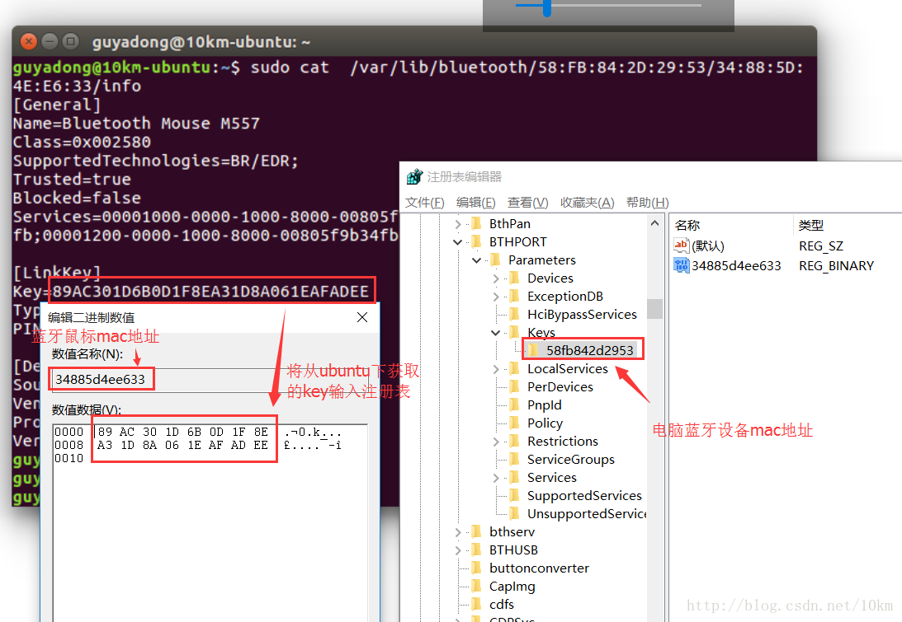
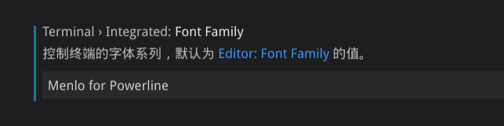

# manjaro配置

## 更换国内源
1. 生成中国镜像列表，然后排序，选择最快的镜像，刷新缓存

```
sudo pacman-mirrors -i -c China -m rank
sudo pacman -Syy
```

2. 添加archlinuxcn中文社区仓库

- 添加在“/etc/pacman.conf”文件末尾添加:

```
[archlinuxcn]
#SidLevel = Optional TrustAll
Server = https://mirrors.ustc.edu.cn/archlinuxcn/$arch
```

- 安装archlinuxcn-keyring包导入GPGkey

```
sudo pacman -Sy archlinuxcn-keyring
```

## 安装yay

```
sudo pacman -S yay
```

## 对于key错误签名失败之类

```
#移除旧的keys
sudo rm -rf /etc/pacman.d/gnupg

#初始化pacman的keys
sudo pacman-key --init

#加载签名的keys
sudo pacman-key --populates archlinux

#刷新升级已经签名的keys
sudo pacman-key -refresh-keys

#清空并且下载新数据
sudo pacman -Sc

#更新
sudo pacman -Syu
```

## 出现无法锁定db错误

```
sudo rm /var/lib/pacman/db.lck
```

## 配置github信息

```
git config --global user.name "ChaunceyCX"
git config --global user.email "chaunceyxcx@gmail.com"
#存储密码
git config credential.helper store
```

## 解决关机30s问题

编辑/etc/systemd/system.conf文件

```
#将

#DefaultTimeoutStopSec=90s

#更改为

DefaultTimeoutStopSec=10s
```

## 安装中文字体

```
yay -S wqy-microhei wqy-microhei-lite wqy-bitmapfont wqy-zenhei ttf-arphic-ukai ttf-arphic-uming adobe-source-han-sans-cn-fonts
```

## 安装配置npm

```
yay -S npm
#设置淘宝源
npm config set registry https://registry.npm.taobao.org
```


## 开机自动挂载硬盘

配置/etc/fstab

```
UUID=0004BF5B00099851                     /home/chauncey/hd1 ntfs nouser,rw 0 0
UUID=096EFA44E563571A                     /home/chauncey/hd2 ntfs nouser,rw 0 0
```

## jdk

1. 下载解压并移动到/opt/

```
x ./jdk-8u221-linux-x64.tar.gz
mv xxx /opt/
```

2. 配置环境变量

修改/etc/profile

```
JAVA_HOME=/opt/jdk1.8.0_221
CLASSPATH=.:$JAVA_HOME/lib/tools.jar:$JAVA_HOME/lib/dt.jar
PATH=$JAVA_HOME/bin:$PATH
export JAVA_HOME CLASSPATH PATH
```

3. 启用配置

```
source /etc/profile
java -version
```

## maven

1. 下载并解压移动到/opt/

```
x ./apache-maven-3.6.1-bin.tar.gz
sudo mv ./apache-maven-3.6.1 /opt/
sudo chown root:root ./apache-maven-3.6.1/
```

2. 配置环境变量

修改/etc/profile

```
MAVEN_HOME=/opt/apache-maven-3.6.1
PATH=${PATH}:${MAVEN_HOME}/bin 
export MAVEN_HOME PATH
```

3. 启用配置

```
source /etc/profile
mvn -v
```

4. 仓库及其它
   
[setting.xml]()


## 双系统蓝牙设备连接

1. win10下建立与鼠标的蓝牙配对
2. 切换到manjaro下建立蓝牙鼠标配对
3. 获取配对linkkey

```
sudo -i
cd /var/lib/bluetooth/
ls -l
#进入电脑蓝牙mac目录
cd {PC-mac}
# 找到蓝牙键鼠的mac地址命名的文件夹
cd {mac}
cat info  //查看蓝牙链接信息
复制LinkKey
```

4. 切换到win10,下载[PSTooLs](https://technet.microsoft.com/en-us/sysinternals/bb897553)

将压缩包解压后,以管理员身份运行cmd,在解压目录下执行命令打开特殊注册表

```
PsExec.exe -s -i regedit
```

找到```HKEY_LOCAL_MACHINE\SYSTEM\CurrentControlSet\services\BTHPORT\Parameters\Keys\```

如下图:

5. 讲设备对应的key替换

## vscode zsh乱码

1. 下载需要的字体

```
cd /usr/share/fonts/
sudo git clone https://github.com/abertsch/Menlo-for-Powerline.git
sudo fc-cache -f -v
```

2. 设置vscode中终端的字体



groovyScript("def result=''; def params=\"${_1}\".replaceAll('[\\\\[|\\\\]|\\\\s]', '').split(',').toList(); for(i = 0; i < params.size(); i++) 
{ if(i!=0)result+= ' * '; if(i==0)result+=params[i] + ((i < (params.size() - 1)) ? '\\n' + ' ' : ''); else result+='@param ' + params[i] + ((i < (params.size() - 1)) ? '\\n' + ' ' : ''); 
}; return result", methodParameters())

## 显卡


