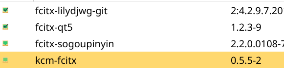

## 安装输入法



创建配置文件~/.pam_environment
添加:

```
export GTK_IM_MOUDLE=fcitx
export QT_IM_MOUDLE=fcitx
export XMODIFIERS="@im=fcitx"
```

注销重新登录就可以使用了

## 安装latte-dock

## zsh配置

1. 将konsole和aykuake的命令改为"/bin/zsh"

2. 安装oh-my-zsh

```
git clone git://github.com/robbyrussell/oh-my-zsh.git ~/.oh-my-zsh
```

3. 修改主题等

```
vim ~/.zshrc
```

配置文件备份位置:
[.zshrc](https://github.com/ChaunceyCX/my-config-files/blob/master/zsh/.zshrc)


4. 更新配置

```
source ~/.zshrc
```

5. 安装插件:

```
#自动推荐
git clone git://github.com/zsh-users/zsh-autosuggestions ~/.oh-my-zsh/plugins/zsh-autosuggestions

#高亮
git clone https://github.com/zsh-users/zsh-syntax-highlighting.git ~/.oh-my-zsh/plugins/zsh-syntax-highlighting

#高亮版cat
yay -S bat

#自动补全
wget http://mimosa-pudica.net/src/incr-0.2.zsh
mkdir /home/chauncey/.oh-my-zsh/plugins/incr/
mv ./incr-0.2.zsh ~/.oh-my-zsh/plugins/incr/

#autjump
yay -S autojump

```

## 开机启动蓝牙

修改"/etc/bluetooth/main.conf"

```
[Policy]
AutoEnable=true
```

## 美化

1. 面板:


2. 主题等


## 程序面板部件

- google-chrome
- vscode
	- zh
	- markdown-all-in-one
	- IntelliJ IDEA Keybindings
- idea
- telegram
- latte-dock
- flameshot
- 面板
  - 程序启动器
  - application title(需要额外安装)
  - 调度器
  - 显示配置
  - netspeed widget(额外安装)
  - 系统a负荷查看器-微型
  - 查找搜索(配置快捷键为command+f)
  - 数字时钟
  - 系统托盘
  - 电源

