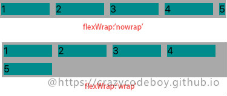
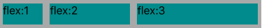

# React Native 布局相关

## React Native布局方式(FlexBox弹性框)

FlexBox提供了在不同尺寸设备上都能保持一致的布局方式。

### 像素无关

在React Native中尺寸是没有单位的，它代表了设备独立像素。

```
<View style={ {width:100,height:100,margin:40,backgroundColor:'gray'}}>
        <Text style={ {fontSize:16,margin:20}}>尺寸</Text>
</View>
```

上述代码，运行在Android上时，View的长和宽被解释成：100dp 100dp单位是dp，字体被解释成16sp 单位是sp，运行在iOS上时尺寸单位被解释称了pt，这些单位确保了布局在任何不同dpi的手机屏幕上显示不会发生改变；

###  和而不同

值得一提的是，React Native中的FlexBox 和Web CSSS上FlexBox工作方式是一样的。但有些地方还是有些出入的，如：

- flexDirection: React Native中默认为flexDirection:'column'，在Web CSS中默认为flex-direction:'row'
- alignItems: React Native中默认为alignItems:'stretch'，在Web CSS中默认align-items:'flex-start'
- flex: 相比Web CSS的flex接受多参数，如:flex: 2 2 10%;，但在 React Native中flex只接受一个参数
- 不支持属性：align-content，flex-basis，order，flex-basis，flex-flow，flex-grow，flex-shrink

## layout props

### Flex in ReactNative

以下是ReactNative所支持的属性

#### 父视图属性
>- flexDirection enum(‘row’, ‘column’,’row-reverse’,’column-reverse’)
>- flexWrap enum(‘wrap’, ‘nowrap’)
>- justifyContent enum(‘flex-start’, ‘flex-end’, ‘center’, ‘space-between’, ‘space-around’)
>- alignItems enum(‘flex-start’, ‘flex-end’, ‘center’, ‘stretch’)

- 主轴和侧轴
  
  主轴和侧轴概念

  
主轴即水平方向的轴线，可以理解成横轴，侧轴垂直于主轴，可以理解为竖轴。

1. flexDirection
   
   flexDirection enum('row', 'column','row-reverse','column-reverse')
flexDirection属性定义了父视图中的子元素沿横轴或侧轴方片的排列方式。

>row: 从左向右依次排列
>row-reverse: 从右向左依次排列
>column(default): 默认的排列方式，从上向下排列
>column-reverse: 从下向上排列

2. flexWrap
   
   flexWrap enum('wrap', 'nowrap')
flexWrap属性定义了子元素在父视图内是否允许多行排列，默认为nowrap。

>nowrap flex的元素只排列在一行上，可能导致溢出。
>wrap flex的元素在一行排列不下时，就进行多行排列。

显示效果：
>

3. justifyContent
    
justifyContent enum('flex-start', 'flex-end', 'center', 'space-between', 'space-around') 
justifyContent属性定义了浏览器如何分配顺着父容器主轴的弹性（flex）元素之间及其周围的空间，默认为flex-start。
>flex-start(default) 从行首开始排列。每行第一个弹性元素与行首对齐，同时所有后续的弹性元素与前一个对齐。
>
>flex-end 从行尾开始排列。每行最后一个弹性元素与行尾对齐，其他元素将与后一个对齐。
>
>center 伸缩元素向每行中点排列。每行第一个元素到行首的距离将与每行最后一个元素到行尾的距离相同。
>
>space-between 在每行上均匀分配弹性元素。相邻元素间距离相同。每行第一个元素与行首对齐，每行最后一个元素与行尾对齐.
>
>space-around 在每行上均匀分配弹性元素。相邻元素间距离相同。每行第一个元素到行首的距离和每行最后一个元素到行尾的距离将会是相邻元素之间距离的一半。

>

4. alignItems

alignItems enum('flex-start', 'flex-end', 'center', 'stretch')
alignItems属性以与justify-content相同的方式在侧轴方向上将当前行上的弹性元素对齐，默认为stretch。
>flex-start 元素向侧轴起点对齐。
>
>flex-end 元素向侧轴终点对齐。
>
>center 元素在侧轴居中。如果元素在侧轴上的高度高于其容器，那么在两个方向上溢出距离相同。
>
>stretch 弹性元素被在侧轴方向被拉伸到与容器相同的高度或宽度。
>

#### 子视图属性

. alignSelf('auto', 'flex-start', 'flex-end', 'center', 'stretch')
. flex number

1. alignSelf
   
alignSelf enum('auto', 'flex-start', 'flex-end', 'center', 'stretch')

alignSelf属性以属性定义了flex容器内被选中项目的对齐方式。注意：alignSelf 属性可重写灵活容器的 alignItems 属性。

>auto(default) 元素继承了它的父容器的 align-items 属性。如果没有父容器则为 “stretch”。
>
>stretch	元素被拉伸以适应容器。
>
>center	元素位于容器的中心。
>
>flex-start	元素位于容器的开头。
>
>flex-end	元素位于容器的结尾。
>

2. flex
   
flex number

flex属性定义了一个可伸缩元素的定义,默认为0

>

#### 其它布局

ReactNative所支持的除了Flex以外的其它布局属性

1. 试图边框
>borderBottomWidth number 底部边框宽度
>
>
>borderLeftWidth number 左边框宽度
>
>borderRightWidth number 右边框宽度
>
>borderTopWidth number 顶部边框宽度
>
>borderWidth number 边框宽度
>
>border<Bottom	Left	Right	Top>Color 个方向边框的颜色
>
>borderColor 边框颜色

2. 尺寸
  
- width number
- height number
  
3. 外边距
   
- margin number 外边距
- marginBottom number 下外边距
- marginHorizontal number 左右外边距
- marginLeft number 左外边距
- marginRight number 右外边距
- marginTop number 上外边距
- marginVertical number 上下外边距

4. 内边距

- padding number 内边距
- paddingBottom number 下内边距
- paddingHorizontal number 左右内边距
- paddingLeft number 做内边距
- paddingRight number 右内边距
- paddingTop number 上内边距
- paddingVertical number 上下内边距

5. 边缘

- left number 属性规定元素的左边缘。该属性定义了定位元素左外边距边界与其包含块左边界之间的偏移。
- right number 属性规定元素的右边缘。该属性定义了定位元素右外边距边界与其包含块右边界之间的偏移
- top number 属性规定元素的顶部边缘。该属性定义了一个定位元素的上外边距边界与其包含块上边界之间的偏移。
- bottom number 属性规定元素的底部边缘。该属性定义了一个定位元素的下外边距边界与其包含块下边界之间的偏移。

6. 定位

position enum(‘absolute’, ‘relative’)属性设置元素的定位方式，为将要定位的元素定义定位规则。

- absolute：生成绝对定位的元素，元素的位置通过 “left”, “top”, “right” 以及 “bottom” 属性进行规定。
- relative：生成相对定位的元素，相对于其正常位置进行定位。因此，”left:20” 会向元素的 LEFT 位置添加 20 像素。